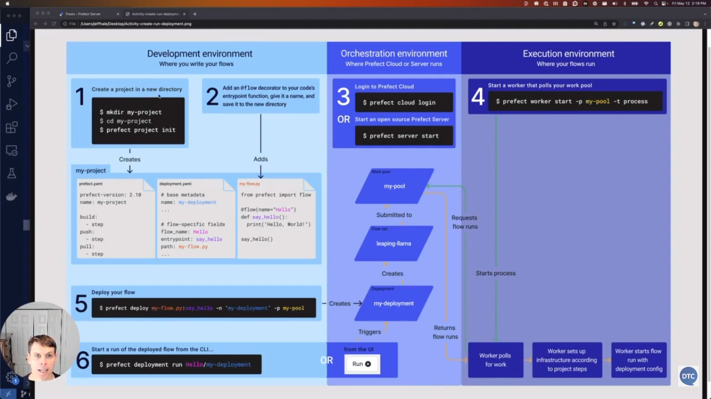

# 3.4 - Deploying your Workflow

## Key Takeaways

* The video teaches how to deploy workflows using Prefect projects for productionizing.
* It covers configuring the project and deployment with the pull step.
* It explains how to deploy and run a flow with a worker pool.
* It explores how to set up deployment from GitHub for collaboration purposes.
* The video is suitable for anyone who wants to learn how to deploy workflows using Prefect projects and collaborate with others on GitHub.

